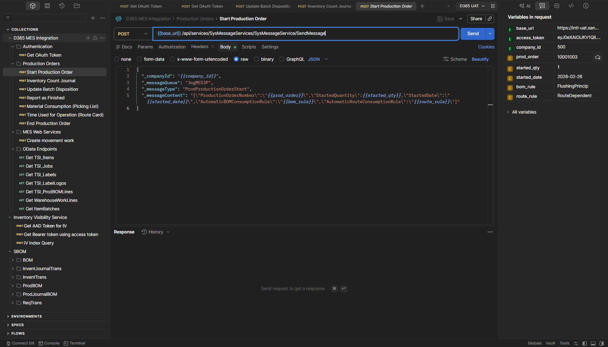

# D365 MES Collections

This repository contains Postman collections for testing Dynamics 365 Supply Chain Management Manufacturing Execution System (MES) related services.

## Collections Overview

### 1. D365 MES Integration Collection
**File**: `D365_MES_Integration.postman_collection.json`

Provides requests for interacting with the Dynamics 365 MES Integration API (message-based) and OData endpoints for retrieving data from TSI custom entities and standard D365 entities.

**Features:**
- **MES Message API**: Pre-configured requests for production order operations (Start, Report Finished, Material Consumption, etc.)
- **MES Web Services**: Synchronous request/response calls to the TSI custom web service layer (`TSIMesWebServices/TSIMesWebService/process`), used where an immediate response or return value is required
- **OData Endpoints**: Queries for TSI custom entities and standard D365 entities (WarehouseWorkLines, ItemBatches)
- **Business Events (Service Bus)**: Peek-lock requests for D365 business events published to Azure Service Bus topics, with SAS token authentication computed at request time
- **Comprehensive Variables**: 70+ variables covering all possible fields
- **OAuth Authentication**: Client credentials flow with automatic token storage
- **Environment Support**: Separate environments for Development and UAT

### 2. Secret Bill of Materials (SBOM) Collection
**File**: `SBOM.postman_collection.json`

Provides requests for validating that Dynamics 365 Extended Data Security (XDS) policies correctly restrict access to items in the range **18000–18499** across all protected OData data entities.

**Features:**
- **Seven table-scoped folders**: Requests are organised by the underlying D365 table targeted by the XDS policy (BOM, InventJournalTrans, InventTrans, ProdBOM, ProdCalcTrans, ProdJournalBOM, ReqTrans)
- **Leak detection tests**: Each request asserts that no item in the restricted range appears in any item-related field of the response
- **Access-verification tests**: Where test data is expected to exist, a separate assertion confirms that at least one record was returned — distinguishing a correctly filtered response from a broken connection or overly broad policy block
- **Correct field names per entity**: Item fields are taken directly from the OData $metadata (e.g. `ItemNumber`, `ItemId`, `ComponentItemNumber`) rather than assumed
- **Scoped queries**: BOM version and production header requests are filtered to the test items (`85375` and `89002`) rather than returning all company data
- **OAuth Authentication**: Reuses the same client credentials bearer token pattern as the other collections

### 3. Inventory Visibility Service Collection
**File**: `Inventory_Visibility.postman_collection.json`

Provides requests for testing the Dynamics 365 Inventory Visibility Service API.

**Features:**
- **AAD Token Authentication**: Client credentials flow to obtain Azure AD access token
- **IV Bearer Token**: Exchange AAD token for Inventory Visibility service bearer token
- **Index Query**: Query inventory on-hand data with filtering and grouping capabilities
- **Environment Support**: Separate environments for UAT and Production

## Setup

### D365 MES Integration Collection

1. Import the collection: `D365_MES_Integration.postman_collection.json`
2. Import the environments:
   - `D365_Dev.postman_environment.json` for Development
   - `D365_UAT.postman_environment.json` for UAT

3. Update the environment variables with your actual values:
   - `tenant_id`: Your Azure AD tenant ID
   - `client_id`: Application (client) ID from Azure AD app registration
   - `client_secret`: Client secret from Azure AD app registration
   - `company_id`: Company ID in D365 (e.g., "500")
   - `base_url`: D365 environment base URL (e.g., `https://your-env.operations.dynamics.com`)

4. Set the test-data environment variables for your system:

   | Variable | Description |
   |---|---|
   | `prod_order` | Production order number used across all MES requests |
   | `item_number` | Item number used in picking list, OData, and other requests |
   | `item_batch_number` | Batch number for the item being consumed |
   | `license_plate_number` | License plate number for warehouse operations |
   | `batch_number` | Batch number for inventory count journal |
   | `disposition_code` | Batch disposition code (e.g. `QUARANTINE`) |
   | `location` | Warehouse location |
   | `warehouse` | Warehouse ID |
   | `site` | Site ID |
   | `source_location` | Source location for movement work |
   | `destination_location` | Destination location for movement work |
   | `production_warehouse_location_id` | Production warehouse location |
   | `production_warehouse_id` | Production warehouse ID |
   | `production_site_id` | Production site ID |
   | `started_qty` | Quantity to start on the production order |
   | `good_qty` | Good quantity for Report as Finished |
   | `consumed_qty` | Quantity consumed per picking list line |
   | `operation_num` | Route card operation number |
   | `hours` | Hours for the route card operation |
   | `counted_qty` | Counted quantity for inventory count journal |
   | `count_date` | Count date for inventory count journal |

5. Set the Service Bus variables for the **Business Events** folder:

   | Variable | Description |
   |---|---|
   | `servicebus_connection_string` | Full SAS connection string from the Azure Service Bus namespace (e.g. `Endpoint=sb://...;SharedAccessKeyName=...;SharedAccessKey=...`) |
   | `servicebus_topic_released` | Topic name for `TSIProductionOrderReleasedToMESBusinessEvent` |
   | `servicebus_sub_released` | Subscription name under the above topic |
   | `servicebus_topic_updated` | Topic name for `TSIProductionOrderUpdatedMESEvent` |
   | `servicebus_sub_updated` | Subscription name under the above topic |
   | `servicebus_peek_count` | Max messages to peek per request (default: `10`, informational only) |

   The variables `servicebus_namespace` and `servicebus_sas_token` are **populated automatically** by the folder pre-request script — do not edit them manually.

### Secret Bill of Materials (SBOM) Collection

1. Import the collection: `SBOM.postman_collection.json`
2. Import an existing D365 environment:
   - `D365_Dev.postman_environment.json` for Development
   - `D365_UAT.postman_environment.json` for UAT

3. Ensure the following environment variables are set:
   - `tenant_id`: Your Azure AD tenant ID
   - `client_id`: Application (client) ID from Azure AD app registration
   - `client_secret`: Client secret from Azure AD app registration
   - `company_id`: Legal entity (e.g., "500")

4. The collection contains the following collection-level variables — update them if your test data changes:

   | Variable | Default | Purpose |
   |---|---|---|
   | `parentItem` | `85375` | The manufactured item whose BOM is under test |
   | `phantomItem` | `89002` | Phantom sub-assembly item whose components are restricted |
   | `controlItems` | `14244,18963,18959` | Non-restricted direct components that must remain visible |
   | `restrictedRangeMin` | `18000` | Lower bound of the XDS-restricted item number range |
   | `restrictedRangeMax` | `18499` | Upper bound of the XDS-restricted item number range |
   | `restrictedItems` | `18009,18011,18014,18015` | Comma-separated specific restricted items present in test data, used as OData `eq`/`or` filters where range operators are unsupported |
   | `productionOrderNumber` | `10001108` | Production order number used to filter production-order-scoped entities |

   The following variables are **auto-built at runtime** by the collection pre-request script from `restrictedItems` — do not edit them manually:

   | Variable | OData field targeted |
   |---|---|
   | `restrictedItems_ItemNumber` | `ItemNumber` |
   | `restrictedItems_ItemId` | `ItemId` |
   | `restrictedItems_ProductNumber` | `ProductNumber` |
   | `restrictedItems_TaxInventVATItemId` | `TaxInventVATItemId` |
   | `restrictedItems_TSIItemId` | `TSIItemId` |
   | `restrictedItems_Resource` | `Resource` |

### Inventory Visibility Service Collection

1. Import the collection: `Inventory_Visibility.postman_collection.json`
2. Import the environments:
   - `Inventory_Visibility_UAT.postman_environment.json` for UAT
   - `Inventory_Visibility_Production.postman_environment.json` for Production

3. Update the environment variables with your actual values:
   - `tenant_id`: Your Azure AD tenant ID
   - `client_id`: Application (client) ID from Azure AD app registration
   - `client_secret`: Client secret from Azure AD app registration
   - `aad_scope`: Azure AD app scope (format: `app-id/.default`)
   - `iv_scope`: Inventory Visibility service scope (usually `https://inventoryservice.operations365.dynamics.com/.default`)
   - `environment_id`: Your D365 environment ID
   - `context_type`: Usually "finops-env"
   - `iv_base_url`: Inventory Visibility service base URL (region-specific)
   - Sample filter values: `product_id`, `site_id`, `location_id`, `organization_id`

## Usage

### D365 MES Integration

1. Select the appropriate environment (Dev or UAT)
2. Run the "Get OAuth Token" request to obtain an access token
3. Set the test-data environment variables for your scenario (production order, item number, quantities, etc.)
4. For MES requests, modify the request body to include additional fields as needed
5. For OData requests, adjust filter variables as needed

### MES Web Services (Synchronous)

1. Select the appropriate environment (Dev or UAT)
2. Run the "Get OAuth Token" request to obtain an access token
3. Open the **MES Web Services** folder
4. Set the `license_plate_number`, `source_location`, and `destination_location` environment variables for your scenario
5. Run the **Create movement work** request; the response body contains the result synchronously — no polling required

### Business Events (Service Bus)

1. Ensure the Service Bus environment variables are set (see Setup above)
2. Open the **Business Events (Service Bus)** folder in the collection
3. Run either peek request:
   - **Peek - TSIProductionOrderReleasedToMESBusinessEvent** — peeks a message from the Released event topic
   - **Peek - TSIProductionOrderUpdatedMESEvent** — peeks a message from the Updated event topic
4. The test script logs the message body and `BrokerProperties` (MessageId, LockToken, SequenceNumber) to the Postman console, then automatically abandons the lock

> **Note:** The Azure Service Bus HTTP REST API only supports **peek-lock** (not a true non-destructive peek). Each peek increments the message delivery count. If the delivery count reaches the topic/subscription's `MaxDeliveryCount` limit, the message is moved to the Dead Letter Queue (DLQ). To inspect messages without side effects, use the [Azure Portal Service Bus Explorer](https://learn.microsoft.com/azure/service-bus-messaging/explorer) (Peek mode) or the `az servicebus` CLI.

### Secret Bill of Materials (SBOM)

1. Select the appropriate environment (Dev or UAT)
2. Run the "Get OAuth Token" request from the D365 MES Integration collection to obtain an access token (or add one to this collection)
3. Run an individual folder to validate a specific D365 table's XDS policy, or run the entire collection to validate all tables at once
4. A passing run means no restricted items (18000–18499) leaked through; a failing "Records returned" test means the querying identity may lack access entirely — check the service account's role assignments

### Inventory Visibility Service

1. Select the appropriate environment (UAT or Production)
2. Run the "Get AAD Token for IV" request to obtain an Azure AD access token
3. Run the "Get Bearer token using access token" request to exchange for IV service token
4. Run the "IV Index Query" request to query inventory data
5. Adjust filter variables as needed for your test data

## MES Integration Details

### Business Events (Service Bus)

The **Business Events (Service Bus)** folder contains peek requests for D365 business events delivered to Azure Service Bus topics.

**Authentication:** A SAS token is computed from the `servicebus_connection_string` environment variable in the folder's pre-request script using `CryptoJS.HmacSHA256`. The derived `servicebus_namespace` and `servicebus_sas_token` variables are written to the environment automatically.

**Requests:**

| Request | Topic variable | Subscription variable | Business event |
|---|---|---|---|
| Peek - TSIProductionOrderReleasedToMESBusinessEvent | `servicebus_topic_released` | `servicebus_sub_released` | `TSIProductionOrderReleasedToMESBusinessEvent` |
| Peek - TSIProductionOrderUpdatedMESEvent | `servicebus_topic_updated` | `servicebus_sub_updated` | `TSIProductionOrderUpdatedMESEvent` |

Each request uses `POST .../messages/head?timeout=60` (peek-lock, HTTP 201) or receives HTTP 204 when no messages are queued. The test script parses the `BrokerProperties` response header and abandons the lock via a follow-up `PUT` request so the message remains on the subscription.

### MES Web Services (Synchronous)

The **MES Web Services** folder provides synchronous request/response calls to the TSI custom web service layer. Unlike the message-based `SysMessageService` (which queues work asynchronously and returns no payload), these calls return a result immediately.

**Endpoint:** `POST {{base_url}}/api/services/TSIMesWebServices/TSIMesWebService/process`

**Authentication:** `Bearer {{access_token}}` (same OAuth token used by all other collection requests)

**Requests:**

| Request | Description | Key body fields |
|---|---|---|
| Create movement work | Creates a warehouse movement work order synchronously | `LicensePlate`, `SourceLocation`, `DestinationLocation`, `Quantity`, `ItemId`, `DataAreaId` |

**Environment variables used:**

| Variable | Purpose |
|---|---|
| `license_plate_number` | License plate to move |
| `source_location` | Origin warehouse location |
| `destination_location` | Target warehouse location |

`DataAreaId` is sourced from the `company_id` environment variable. `Quantity` and `ItemId` are set directly in the request body.

### MES Message API Requests

The collection includes requests for all standard MES message types:
- Start Production Order
- Report as Finished
- **Material Consumption (Picking List)** — the request body contains the message content directly as readable JSON with `{{variable}}` tokens. Edit the body to adjust field values or add more objects to the `PickingListLines` array for multi-line consumption. A pre-request script resolves variables and wraps the body in the `SysMessageService` envelope before sending.
- Time Used for Operation (Route Card)
- End Production Order

### OData Endpoints

The collection includes OData queries for TSI custom entities and standard D365 entities using $filter syntax:

- **Get TSI_Items**: `?$filter=dataAreaId eq '{{company_id}}' and ItemId eq '{{item_number}}'`
- **Get TSI_Jobs**: `?$filter=dataAreaId eq '{{company_id}}' and ProdId eq '{{prod_order}}'`
- **Get TSI_Labels**: `?$filter=dataAreaId eq '{{company_id}}' and ProdId eq '{{prod_order}}'&$expand=Logos`
- **Get TSI_LabelLogos**: Retrieves all label logos data
- **Get TSI_ProdBOMLines**: `?$filter=dataAreaId eq '{{company_id}}' and ProdId eq '{{prod_order}}'`
- **Get WarehouseWorkLines**: `?$filter=dataAreaId eq '{{company_id}}' and WarehouseWorkStatus ne Microsoft.Dynamics.DataEntities.WHSWorkStatus'Closed' and WarehouseWorkStatus ne Microsoft.Dynamics.DataEntities.WHSWorkStatus'Cancelled'&$select=LicensePlateNumber,WarehouseWorkStatus,WarehouseWorkId,ItemNumber`
- **Get ItemBatches**: `?$filter=dataAreaId eq '{{company_id}}' and BatchDispositionCode eq '{{disposition_code}}'&$select=ItemNumber,BatchNumber,BatchDispositionCode,ManufacturingDate,BatchExpirationDate`

These endpoints use the same authentication as the MES requests. The variables `item_number`, `prod_order`, and `disposition_code` are set in the active environment.

### Variables

The MES collection uses two scopes for variables:

**Environment variables** (set per Dev/UAT environment) cover all test-data fields: production order numbers, item numbers, quantities, locations, and warehouse identifiers. This allows Dev and UAT to have completely independent test data without touching the collection.

**Collection variables** cover behavioural configuration that is consistent across environments:

- **Dates**: `started_date`, `report_date`, `consumption_date`, `ended_date` — set automatically by a collection-level pre-request script using today's date
- **Consumption Rules**: `bom_rule`, `route_rule`, `automatic_bom_consumption_rule`, `automatic_route_consumption_rule`
- **Journal Settings**: `journal_name_id`, `picking_list_journal_name_id`, `route_card_journal_name_id`, `automatic_bom_consumption_rule`, `end_job`, `end_picking_list`, `end_route_card`
- **Inventory Dimensions**: 12 dimensions for tracking inventory attributes
- **Product Attributes**: 10 custom product attributes
- **Operation Details**: Priority, description, resource information, timing
- **Quality Control**: Good/error/scrap quantities, error causes
- **Worker & Equipment**: Worker, shift, team, machine, tool information
- **Custom Properties**: 10 additional custom properties

## SBOM Details

### Test Data Structure

The collection is designed around a specific phantom BOM scenario:

- **Parent item** (`85375`): The manufactured item. Its BOM contains non-restricted direct components and the phantom item `89002`.
- **Phantom item** (`89002`): A phantom BOM sub-assembly. All of its BOM components fall within the restricted range and should be invisible to the XDS-restricted identity.
- **Control items** (`14244`, `18963`, `18959`): Non-restricted direct components of `85375`. These must remain visible — their absence would indicate a broader access problem rather than XDS working correctly.
- **Restricted items** (`18009`, `18011`, `18014`, `18015`): Components of the phantom BOM. These must not appear in any response.

### Folder Structure

Each folder corresponds to one D365 table covered by the XDS policy:

| Folder | Table | What is tested |
|---|---|---|
| BOM | `BOM` | BOM and formula line entities filtered to items `85375` and `89002`; checks `ItemNumber` |
| InventJournalTrans | `InventJournalTrans` | All inventory journal transaction entities (adjustment, movement, transfer, counting) |
| InventTrans | `InventTrans` | Inventory transaction entities (`ItemId` field) |
| ProdBOM | `ProdBOM` | Production order BOM line entities; checks both `ItemNumber` (produced) and `ComponentItemNumber` (component) |
| ProdCalcTrans | `ProdCalcTrans` | Production cost calculation transaction entities; checks `Resource` field |
| ProdJournalBOM | `ProdJournalBOM` | Production picking list journal entries |
| ReqTrans | `ReqTrans` | Dynamic plan production order schedule entity (folder intentionally empty — entity has OData=No in D365) |

### Test Assertions

Every request in the collection runs three tests:

1. **Status 200 OK** — confirms the endpoint is reachable and the token is valid
2. **No restricted items (18000–18499) present** — iterates every record in the response and checks all configured item fields; fails with a descriptive `XDS LEAK –` message including the exact field and value if a restricted item is found
3. **Records returned** (where applicable) — fails if the response is empty, which would otherwise cause test 2 to silently pass for the wrong reason

Entities where test data may not exist in all environments (e.g. formula/PMF entities, EDI entities) skip assertion 3 and emit a console warning instead.

## Inventory Visibility Details

### Requests

#### Get AAD Token for IV
Obtains an Azure AD access token using client credentials flow.

#### Get Bearer token using access token
Exchanges the AAD token for an Inventory Visibility service bearer token using the security service.

#### IV Index Query
Queries inventory on-hand data with the following features:
- Filters by Product ID, Site ID, Location ID, and Organization ID
- Groups results by Batch ID, Location ID, WMS Location ID, and License Plate ID
- Returns negative quantities
- Includes visualizer for formatted results display

### Variables

The Inventory Visibility collection uses environment variables for all configuration. No hardcoded values remain in the collection.

## Notes

### MES Integration
- The MES integration processes messages asynchronously (every 1 minute)
- Check the Manufacturing execution systems integration page in D365 for message status
- Ensure the Time and attendance license key is enabled in D365

### SBOM
- The collection does not include a token request — use "Get OAuth Token" from the D365 MES Integration collection to populate `access_token` before running
- OData returns a maximum of 100 records per request (`$top=100`); if your environment has more than 100 journal lines or transactions for the test data, restricted items could theoretically appear beyond the first page without being caught — adjust `$top` or add pagination handling if this is a concern
- Entities marked `NOT FOUND IN METADATA` in the generator output are custom or EDI entities not published in the standard $metadata; field names for these were inferred from D365 documentation and should be verified against a live response

### Inventory Visibility
- The Inventory Visibility service requires proper Azure AD app registration and permissions
- Environment IDs and service URLs are region-specific
- The index query supports additional filters and grouping options not included in this basic template

## References

- **MES Integration**: https://learn.microsoft.com/en-us/dynamics365/supply-chain/production-control/mes-integration
- **Inventory Visibility**: https://learn.microsoft.com/en-us/dynamics365/supply-chain/inventory/inventory-visibility-api